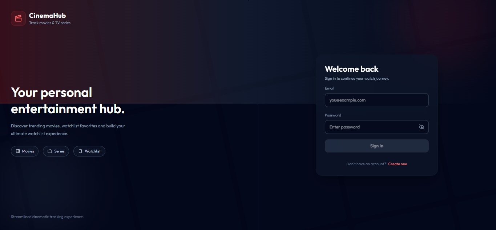
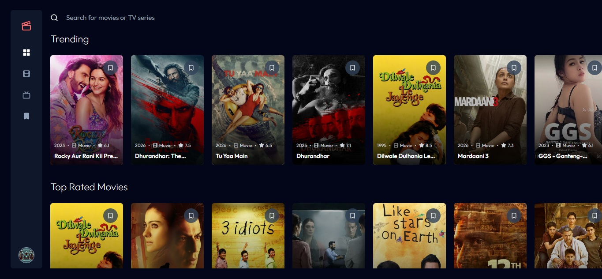
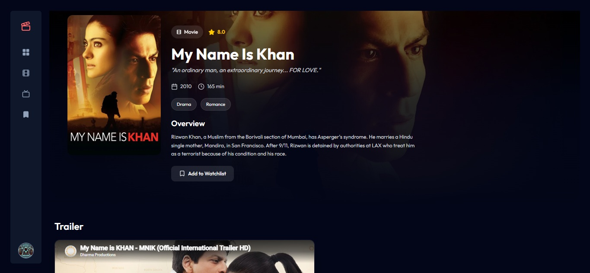
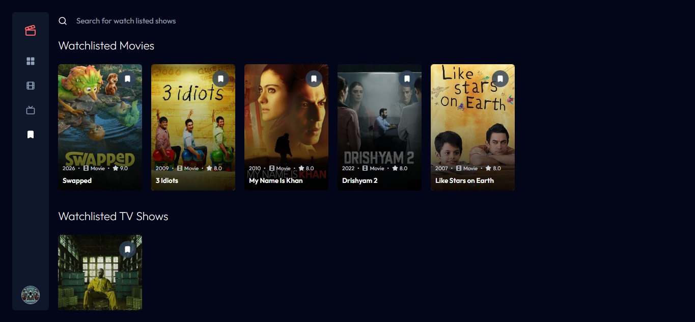
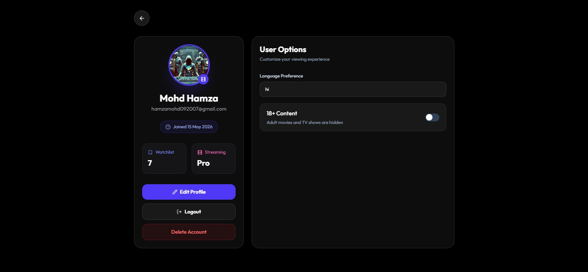
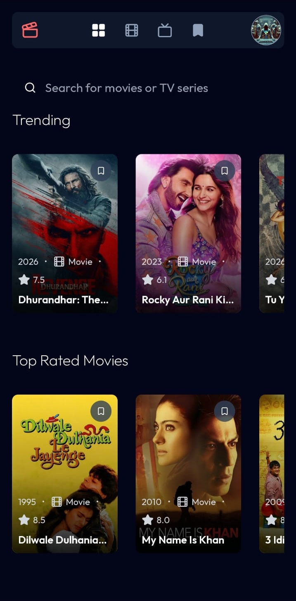

# 🎬 CinemaHub

CinemaHub is a full-stack MERN Entertainment application that allows users to discover, explore, and manage movies & TV series seamlessly with features like authentication, TMDB integration, watchlists, trailers, advanced filtering, and a cinematic responsive UI.

---

## 📌 Overview

CinemaHub allows users to:

- Explore trending and top-rated movies & TV series
- Search movies, shows, and actors instantly
- Save favorite content to a personal watchlist
- Watch official trailers directly inside the app
- Browse content using genres and language filters
- Access detailed movie & series information
- Enjoy a modern cinematic UI across all devices

This project focuses on delivering a premium entertainment browsing experience inspired by modern streaming platforms.

---

## 🛠️ Tech Stack

### Frontend
- React.js
- Tailwind CSS
- React Router DOM

### Backend
- Node.js
- Express.js

### Database
- MongoDB

### Authentication
- JSON Web Token (JWT)
- bcrypt

### APIs & Services
- TMDB API
- YouTube Embed API

### Other Tools & Services
- Vercel (Frontend Deployment)
- Render (Backend Deployment)

---

## ✨ Features

- 🔐 User Authentication (Signup/Login)
- 🎥 Movies & TV Series Browsing
- 🔍 Multi Search Functionality
- 📈 Trending & Top Rated Sections
- 🏷️ Genre-Based Filtering
- 🌐 Language Filtering
- 🔞 Adult Content Toggle
- 📺 Detailed Media Information
- 🎬 Embedded Official Trailers
- ⭐ Ratings & Release Information
- 👥 Cast Information
- 🔖 Personal Watchlist
- 👤 User Profile Page
- 📱 Fully Responsive Design
- 🎨 Modern Cinematic UI

---

## 📸 Screenshots

### Desktop











### Mobile



---

## 🌐 Live Demo

Frontend: [CinemaHub - Vercel](https://cinema-hub-weld.vercel.app) 
Backend: [CinemaHub - Render](https://cinemahub-4ade.onrender.com)

---

## ⚙️ Installation & Setup

```bash
# Clone the repository
git clone https://github.com/your-username/CinemaHub.git

# Navigate to project folder
cd CinemaHub

# Install frontend dependencies
cd client
npm install

# Install backend dependencies
cd ../server
npm install

# Run frontend
npm run dev

# Run backend
npm run server
```

---

## 🔐 Environment Variables

Create a `.env` file in the root and add:

```env
PORT=5000
CLIENT_URL=http://localhost:5173
MONGODB_URL=your_mongodb_connection_string
JWT_SECRET=your_jwt_secret
TMDB_API_KEY=your_tmdb_api_key
```

---

## 🧠 Learnings

- Built a complete MERN stack entertainment platform
- Integrated TMDB API for dynamic movie & TV data
- Implemented secure authentication using JWT & bcrypt
- Learned advanced API handling and state management
- Built reusable and responsive UI components
- Implemented dynamic filtering and search functionality
- Integrated YouTube trailers inside the application
- Improved frontend design and user experience skills

---

## 🚧 Future Improvements

- 🎞️ Continue Watching Feature
- 🔔 Notifications & Recommendations
- ❤️ Favorite Actors & Creators
- 📊 Personalized Recommendations
- 🌙 Theme Customization
- 🎭 Streaming Platform Filters
- 📜 Watch History Tracking
- ⚡ Infinite Scrolling
- 🎥 Video Player Modal Animations

---

## 👨‍💻 Author

**Mohd Hamza**

GitHub: https://github.com/hamzamohd092007

---

## ⭐ Show Your Support

If you like this project, give it a ⭐ on GitHub!
